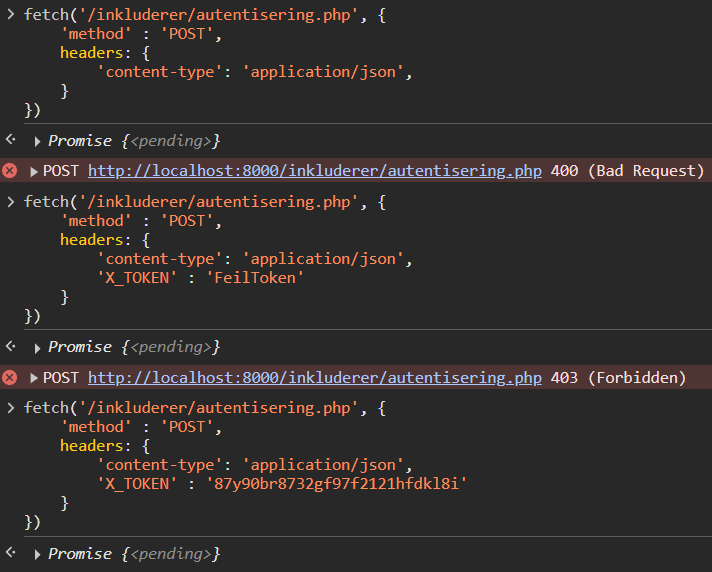
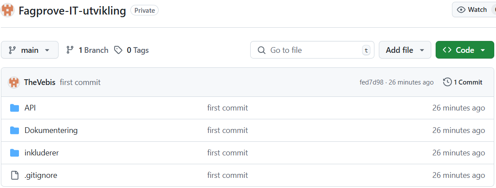
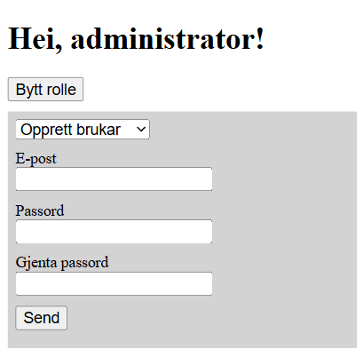

# Fagprøve i IT-utviklerfaget

### _Vebjørn Hjelmeseter_

_17.6.25 - 26.5.25_

# Planlegging

## Sjølve oppgåva

I denne fagprøven har eg fått i oppgåve å lage eit REST-API som skal brukast for administrasjon av brukarar med deira respektive datakontoar. Brukarkontoane skal lagrast i ein database.

Applikasjonens endepunkt forventer å levera:

-   Oppretting av konto
-   Verifikasjon og godkjenning av konto
-   Oversikt over kontoar
-   Administrasjon av kontoar

Sikkerheita i og rundt pålogging, behandling og lagring må være ivaretatt.

Undervegs i gjennomføringa vil prøvenemda presentere ei lita endring, og det må settast av tid til å beskrive korleis endringa påverkar oppgåva, og skissere forslag til evt tilpassningar.

## Skisse

Eg har laga ei skisse over korleis dei ulike endepunkta skal fungere. Den gir et estimat på kva headers og data som skal bli sendt til REST-APIet, og kva CRUD\*-operasjoner den skal utføre i databasen.

> **Opprettelse av konto:**
>
> POST (epost, passord, token) -> INSERT. Bare administratorar med gyldig token skal kunne lage brukarar. Må være unikt brukarnamn. Passord skal hashast. Sende epost til epostadressa med ei lenkje der brukaren kan verifisere seg (Verifikasjon og godkjenning av konto)
>
> **Verifikasjon og godkjenning av konto:**
>
> PUT (epost) -> UPDATE. Sett brukar som verifisert (evt. og lag passord her)
>
> **Oversikt over kontoer:**
>
> GET (token) -> SELECT. returnerer liste over brukarar og evt. anna relevant info
>
> **Administrasjon av kontoer:**
>
> -   Endre passord (brukar kan gjør dette sjølv)
> -   Sette nytt passord (Bare admin)
> -   Slette brukar (Bare admin)
>
> PUT (epost, gammalt passord, nytt passord) -> UPDATE. Må sjekke at brukar med det brukarnamnet og passord finst
>
> PUT (epost, nytt passord, token) -> UPDATE
>
> DELETE (epost, token) -> DELETE

\*CRUD står for Create, Read, Update og Delete. Desse fire er dei grunnleggande operasjonane som kan bli utført i ein database.

-   Create legger til nye rader i databasen. SQL brukar INSERT-uttrykket.
-   Read henter data frå databasen. SQL brukar SELECT-uttrykket.
-   Update endrer eksisterande rader i databasen. SQL brukar UPDATE-uttrykket.
-   Delete fjerner rader frå databasen. SQL brukar DELETE-uttrykket.

## Teknologi og programvare

For å lage REST-APIet skal eg bruke kodespråket PHP til å utføre logikken til dei ulike endepunkta. PHP er eit server-side-programmeringspråk, så eg må hoste det ein plass. Då kan eg enten hoste det lokalt via localhost, eller på HVL sin server.

-   Kjelde: [snl.no/PHP](https://snl.no/PHP)

Eg skal bruke SQLite for databasen brukarkontoane skal lagrast i. SQLite er ein lettvektig relasjonsdatabase som blir ein integrert del av programmet. Databasen blir lagra i ei enkel fil (evt. fleire filer ved store databasar), og krever ingen dedikert server eller spesialisert filsystem. Den enkle bruken av SQLite har ressultert i massiv bruk av SQLite, og blitt det foretrukne databasesystemet for applikasjonar og innebygde einingar. SQLite er derfor veldig relevant teknologi, og det databasesystemet eg har brukt mest.

-   Kjelde: [Hva er SQLite og hvorfor er det så populært?](https://no.linux-console.net/?p=7556)

Eg brukar Visual Studio Code for å skrive koden. Visual Studio Code er ein lett, men kraftig kildekode-editor som er utvikla av Microsoft og fungerer med nesten alle språk. Det er veldig populært og blei brukt av [73,6% av utviklarar i 2024](https://survey.stackoverflow.co/2024/technology#1-integrated-development-environment).

Når REST-APIet er ferdig skal det leggast ut på GitHub. GitHub er ein plattform for utviklarar som brukast til å lagra, administrere og dele kodeprosjekt. Der kan REST-APIet enkelt bli delt og tatt i bruk av andre utviklarar.

-   Kjelde: [Hva er GitHub?](https://mediseo.no/hva-er-github/)

## Utstyr og kostnad

Følgande tabell er utstyret eg brukar ved arbeidsplassen min, og det meste er standard som tilsette får utdelt. Til denne oppgåva er det ingenting som er kjøpt inn, men prisoppslaget er tatt med likevell. Av dette er hodetelefonane og musematta utanom standard, men det blir dekka av avdelinga.

| Type            | Spesifikasjonar                              | Pris (NOK) |
| --------------- | -------------------------------------------- | ---------- |
| Laptop          | AMD Ryzen 5 PRO 3500U, 16 GB RAM, 256 GB SSD | 10000      |
| Skjerm          | Standard 49" Bredskjerm                      | 8000       |
| Docking         | Standard dockingstasjon                      | 3000       |
| Tastatur og mus | Standard tastatur og mus-sett                | 500        |
| Hodetelefonar   | Trådlause hodetelefonar med støydemping      | 3000       |
| Musematte       | Ergonomisk musematte                         | 200        |

_Prisane er estimert._

Total pris: 24 700

## Hjelpemidler

Det er ei rekkje hjelpemidler eg tenkjer å bruke under fagprøven.

Som samarbeidspartnar tenkte eg å bruke Ole Brede som og er lærling i IT-utviklarfaget. Han har god kunnskap om programmering og utvikling og har vert ein god ressurs for meg i læretida. Eg vil og bruke Terje Rudi, som har det faglege ansvaret for oss i læretida, då han har lang erfaring innan utvikling og skreiv oppgåva mi.

Eg har tenkt å bruke dokumentasjon for dei respektive programmeringspråka eg skal bruke.

-   https://www.php.net/docs.php
-   https://www.sqlitetutorial.net/
-   https://www.sqlite.org/docs.html
-   https://developer.mozilla.org/en-US/ (Om eg sku få bruk for HTML, CSS, eller JavaScript)

Eg vil bruke [SQLite Viewer](https://inloop.github.io/sqlite-viewer/) for å visualisere SQLite-databasen min undervegs. SQLite Viewer henter og visualiserer data frå databasen i ei SQLite-fil basert på SQLite-uttrykk. Slik kan ein sjå den komplette databasen eller bare enkelte deler basert på SELECT-uttrykket ein skreiv inn.

Eg vil bruke OpenAIs ChatGPT, levert til oss via https://gpt.uio.no/, som vi får av Universitetet i Oslo. Den lar meg bruke ChatGPT innanfor dei krava UiO sett til personvern. UiO lovar at samtalar og data ikkje blir brukt til trening av KI-modellar, noko som gjer det sikrare enn den vanlege ChatGPT.

For rettskriving vil eg bruke [ordbøkene.no](https://ordbokene.no/), då sjølv om rettskriving ikkje er eit krav synest eg fortsatt det er ein viktig del. Ordbøkene har både bokmål og nynorsk som er bra sidan eg skriv på nynorsk.

## Tidsskjema

| Tysdag 17.6                                 | Onsdag 18.6                                           | Torsdag 19.6                                                | Fredag 20.6                                               | Måndag 23.6                                         | Tysdag 24.6                                   | Onsdag 25.6                               |
| ------------------------------------------- | ----------------------------------------------------- | ----------------------------------------------------------- | --------------------------------------------------------- | --------------------------------------------------- | --------------------------------------------- | ----------------------------------------- |
| 9:00 - 11:30: Planlegging                   | 8:00 - 8:20: Starte dagen                             | 8:00 - 8:20: Starte dagen                                   | 8:00 - 8:20: Starte dagen                                 | 8:00 - 8:20: Starte dagen                           | 8:00 - 8:20: Starte dagen                     | 8:00 - 8:30: Førebuing framføring         |
| 11:30 - 12:00: Lunsjpause                   | 8:20 - 9:20 Sette opp SQLite database                 | 8:20 - 10:00: Lage endepunkt for administrering av brukarar | 8:20 - 10:00: Lage endepunkt for verifisering av brukarar | 8:20 - 10:30: Ferdigstille REST-APIet               | 8:20 - 11:30: Ferdigstille dokumentasjon      | 8:30: Framføring av arbeid for prøvenemda |
| 12:00 - 15:00: Planlegging                  | 9:20 - 10:30: Sette opp sikkerheit med token          | 10:00 - 11:30: Teste/feilsøking av endepunkt                | 10:00 - 11:30: Teste/feilsøking av endepunkt              | 10:30 - 11:30: Legge REST-APIet ut på GitHub        | 11:30 - 12:00: Lunsjpause                     |                                           |
| 17:00: Siste frist for å levere planlegging | 10:30 - 11:30: Lage endepunt for oppretting av brukar | 11:30 - 12:00: Lunsjpause                                   | 11:30 - 12:00: Lunsjpause                                 | 11:30 - 12:00: Lunsjpause                           | 12:00 - 15:00: Førebuing framføring           |
|                                             | 11:30 - 12:00: Lunsjpause                             | 12:00 - 13:00: Lage endepunkt for oversikt over kontoer     | 12:00 - 14:00: Implementere evt. endringar frå prøvenemda | 12:00 - 13:00: Lage testplan                        | 17:00: Siste frist for å levere dokumentasjon |
|                                             | 12:00 - 13:00: Testing/feilsøking av endepunkt        | 13:00 - 14:00: Teste/feilsøking av endepunkt                | 14:00 - 15:00: Dokumentering og gå gjennom oppgåver       | 13:00 - 14:00: Gjennomfør test                      |
|                                             | 13:00 - 15:00: Dokumentering og gå gjennom oppgåver   | 14:00 - 15:00: Dokumentering og gå gjennom oppgåver         |                                                           | 14:00 - 15:00: Dokumentering og gå gjennom oppgåver |

Dokumentering og gå gjennom oppgåver inkluderer å ferdigstille ting eg eventuelt ikkje fekk tid til i løpet av dagen.

# Gjennomføring

# Onsdag 18.6

## Database

Eg byrjar med å sette opp SQLite-databasen som skal lagre alle brukarkontoane. Eg slår fast at den trenger ID, epost, passord og om brukaren er verifisert. Koden blir sjåande slik ut:

```php
// Banen til databasen
$dsn = "sqlite:" . dirname(__DIR__) . DIRECTORY_SEPARATOR . "./database.sqlite3";
$dbh = new PDO($dsn);

// Lager tabellen brukarkontoar
$dbh->query(
    <<<SQL
        CREATE TABLE IF NOT EXISTS brukarkontoar (
            id INTEGER PRIMARY KEY,
            epost TEXT NOT NULL UNIQUE,
            passord_hash TEXT NOT NULL,
            verifisert INT DEFAULT 0
        )
    SQL
);
```

Forklaring av koden:

`$dsn = "sqlite:" . dirname(__DIR__) . DIRECTORY_SEPARATOR . "./database.sqlite3";`

Koden begynner med å definere ein variabel `$dsn`, som skal spesifisere banen til databasen.

`sqlite:` indikerer at det er ein SQLite-database.

`dirname(__DIR__)` hentar banen til mappa over den noverande mappa.
`DIRECTORY_SEPARATOR` gir den riktige mappa-separatoren for operativsystemet (til dømes / for Unix, \ for Windows).

Resultatet av denne koden blir ein fullstendig bane til SQLite-databasen `database.sqlite3` som ligg i ei overordna mappe. Dette er nødvendig då denne fila ligg i ei undermappe i prosjektet.

`$dbh = new PDO($dsn);` bruker PHP sin PDO (PHP Data Objects) klasse for å opprette ein tilkopling til databasen ved hjelp av den definerte DSN.

`$dbh->query(...)` utfører ein SQL-spørring, i dette tilfellet for å opprette ei tabell.

```SQL
CREATE TABLE IF NOT EXISTS brukarkontoar (
    id INTEGER PRIMARY KEY,
    epost TEXT NOT NULL UNIQUE,
    passord_hash TEXT NOT NULL,
    verifisert INT DEFAULT 0
)
```

I SQL-spørringa lagar ein tabellen `brukarkontoar` dersom den ikkje allereie eksisterer. Dette forhindrar feil som kan oppstå ved å prøve å opprette ein tabell som allerede finst.

I tabellen blir kolonnene `id`, `epost`, `passord_hash` og `verifisert` laga.

-   `id` blir satt til eit heiltal (integer) og som primærnøkkelen i tabellen. Primærnøkkelen er unik og blir brukt for å identifisere kvar rad i tabellen.

-   `epost` blir satt til tekst med kolonneavgrensingane `NOT NULL` og `UNIQUE`. `NOT NULL` seier at denne ikkje kan være tom, og `UNIQUE` at den må være unik. Alle brukarar må ha ei e-postadresse og ingen kan ha same.

-   `passord_hash` blir satt til tekst, og som epost har `NOT NULL`. Den har ikkje `UNIQUE`-avgrensinga då fleire kan ha same passord, men grunna hashinga på passordet er det ikkje så veldig relevant.

-   `verifisert` blir satt til eit heiltal med ein `DEFAULT`-verdi på 0. Det er fordi dette skal fungere som ein boolean, enten sann (1) eller usann (0), og når brukaren først blir oppretta er den ikkje verifisert.

## Kjøre PHP

PHP er eit server-side-programmeringspråk og kan ikkje bli køyrt direkte i nettlesaren som ein kan med HTML, CSS og JavaScript. Det må hostast ein stad. Vi har ein web-server som eg kan bruke til å hoste, men eg har gått for å kjøre PHP lokalt på maskina via localhost.

Ole Brede har laga ei løysing for å køyre PHP lokalt på maskina, men den hadde problemer med å opne mappa mi. Vi fann ut av at skriptet ikkje likte spesialtegn, då mappa "Fagprøve IT-utvikling" har ein Ø i seg. Å endre mappenamnet til "Fagprove IT-utvikling" fiksa problemet.

## Sikkerheit med token

For å forsikre seg at ikkje kven som helst kan bruke APIet og byrje å opprette og slette brukarar sett eg inn sikkerheit med hjelp av ein token. I headers som blir sendt inn skal det være ein X_TOKEN som blir lest og sjekka opp mot gyldige tokens.

```php
// Sjekk om server har token
if (!isset($_SERVER["HTTP_X_TOKEN"])) {
    http_response_code(400); // Bad Request
    echo json_encode(["error" => "Ugyldig føre­spurnad"]);
    exit();
}
```

Først sjekker ein om `X_TOKEN` er satt. Om den ikkje er det sender skriptet tilbake feilkoden 400 med Ugyldig føre­spurnad. Ein må sjekke om den er satt fordi det ville skapt problemer lenger ned i koden om den ikkje var det.

```PHP
// Henter inn TOKENS-konstanten
require "tokens.php";

$token = $_SERVER["HTTP_X_TOKEN"];
```

Skriptet krever `tokens.php` som inneheld `TOKENS`-konstanten som er ein array med gyldige tokens. Tokenen til føre­spurnaden blir og lagra som `$token`.

```PHP
// Sjekk om token er gyldig
if (!in_array($token, TOKENS)) {
    http_response_code(403); // Forbidden
    echo json_encode(["error" => "Ugyldig token.", "token" => $_SERVER["HTTP_X_TOKEN"]]);
    exit();
}
```

Til slutt sjekker skriptet om tokenen er ein gyldig token med å sjå om `$token` finnst i `TOKENS`. Visst ikkje sender skriptet tilbake feilkoden 403 Forbudt med Ugyldig token.

Med å kjøre fetch-kall utan token, med feil token og med rett token får vi dette resultatet:



## Opprette brukar

Eit av endepunkta til APIet er at ein skal kunne opprette brukarar i databasen.

```php
// Kjør tokenautentisering
require_once dirname(__DIR__) . DIRECTORY_SEPARATOR . "inkluderer/autentisering.php";

if ($_SERVER["REQUEST_METHOD"] === "POST") {
    // Hent data frå føre­spurnaden
    $json = file_get_contents("php://input");
    $data = json_decode($json, true);

    // Sjekk at data, brukarnamn og passord er satt
    if (!empty($data)) {
        if (!empty($data["epost"]) && !empty($data["passord"])) {
            // Lag databasen om den ikkje finst
            require_once "lag-database.php";

            // Hasher passord for økt sikkerheit
            $hash = password_hash($data["passord"], PASSWORD_DEFAULT);

            // Sett ny brukar inn i databasen med epost og hasha passord
            $sth = $dbh->prepare(
                <<<SQL
                    INSERT INTO brukarkontoar (epost, passord_hash)
                    VALUES (?, ?)
                SQL
            );
            $sth->execute([$data["epost"], $hash]);
        }
    }
}
```

Forklaring av koden:

`require_once dirname(__DIR__) . DIRECTORY_SEPARATOR . "inkluderer/autentisering.php";`
køyrer autentiseringscriptet eg satt opp tidligare. Det passer på at føre­spurnaden har eit gyldig token.

`$_SERVER["REQUEST_METHOD"] === "POST"`
sjekker om metoden til føre­spurnaden er satt til POST. Det betyr at skriptet skal legge til noko nytt i databasen

```php
$json = file_get_contents("php://input");
$data = json_decode($json, true);
```

Denne koden henter så ut innhaldet i føre­spurnaden og dekoder det frå JSON til object som PHP forstår.

#### JSON

> JSON (JavaScript Object Notation) er eit av dei mest brukte formata å strukturere og sende data mellom ulike programmeringsspråk og mellom klient og server. Det er lett for både menneske og maskinar å lese og skrive det, og har brei støtte blant programmeringspråka. Formatet er og veldig kompakt som hjelp med å redusere bandbredde og lastetid i applikasjoner og nettstader.
>
> Her bruker eg det for å sende data som APiet treng for å opprette brukarkonto: e-postadresse og passord.

`!empty($data)` og `!empty($data["epost"]) && !empty($data["passord"])` sjekkar om det faktisk er innhald i føre­spurnaden, og om det er innhaldet endepunktet treng.

`$hash = password_hash($data["passord"], PASSWORD_DEFAULT);` hashar passordet. Det andre parameteret i `password_hash`, er kva algoritme den skal bruke. Eg har brukt `PASSWORD_DEFAULT` som bruker bvcrypt algoritmen for hashing og er den PHP anbefaler.

#### Hashing

> Hashing er ein einvegsfunksjon som tar inn data og produserer ein fast lengde tegn. Sidan det er einvegs er det ikkje mogleg å rekonstruere dataen frå hash-verdien. Dette er optimalt for lagring av passord i databasen då det gjør det vanskeleg for angriparar å hente dei opprinnelege passorda sjølv om dei får tilgong til hash-verdien.
>
> Hashing bruker eit "salt", som er ein tilfeldeg generert streng som legges til passordet før hashing. Sjølv om to brukarar har samme passord gjer saltet at hashane blir forskjellege.
>
> Når ein brukar logger seg inn med passordet henter systemet saltet for den lagrede hashen. Den kombinerer det innsendte passordet med saltet, hasher det, og samanliknar den med den lagra hashen. Er dei like er det korrekt passord.

```php
$sth = $dbh->prepare(
    <<<SQL
        INSERT INTO brukarkontoar (epost, passord_hash)
        VALUES (?, ?)
    SQL
);
$sth->execute([$data["epost"], $hash]);
```

Her lagrar skriptet brukaren og det hasha passordet i databasen. Spørsmålstegna i `VALUES` blir kjørt som innhaldet i `execute(...)` når ein kjører den. Eg brukar `prepare(...)` og `execute(...)` her istaden for `query(...)` (som gjer begge deler på ein gong), då det er sikrare og forhindrar SQL-injeksjon.

#### SQL-injeksjon

> SQL-injeksjon går ut på at brukaren sender inn SQL-kode som har som mål å kjøre i databasen, tildømes å slette ein tabell. Den gjer det med å avslutte den gjeldane spørringa og starte ei ny som brukaren har laga.
>
> 
>
> -https://xkcd.com/327/

### Feilmeldingar

Eg innsåg det kunne være ein ide å legge til feilmeldingar i koden for ein betre brukaropplevelse og gjer det enklare å feilsøkje. Eg gjor dette med `http_response_code` og å sende ein feilmelding tilbake, ikkje ulikt det eg gjor med token-autentiseringa. Eg snudde og litt rundt på if-statements for at koden sku bli meir oversikteleg. Då fekk eg følgande kode:

```php
// Kjør tokenautentisering
require_once dirname(__DIR__) . DIRECTORY_SEPARATOR . "inkluderer/autentisering.php";

if ($_SERVER["REQUEST_METHOD"] === "POST") {
    // Hent data frå forespørselen
    $json = file_get_contents("php://input");
    $data = json_decode($json, true);

    // Sjekk at data er satt
    if (empty($data)) {
        http_response_code(400); // Bad Request
        echo json_encode(["error" => "Ingen data mottatt."]);
        exit();
    }

    // Sjekk at epost og passord er satt
    if (empty($data["epost"]) || empty($data["passord"])) {
        http_response_code(400); // Bad Request
        echo json_encode(["error" => "E-postadresse og passord er påkravd."]);
        exit();
    }

    // Lag databasen om den ikkje finst
    require_once "lag-database.php";

    // Hasher passord for økt sikkerheit
    $hash = password_hash($data["passord"], PASSWORD_DEFAULT);

    try {
        // Sett ny brukar inn i databasen med epost og hasha passord
        $sth = $dbh->prepare(
            <<<SQL
                INSERT INTO brukarkontoar (epost, passord_hash)
                VALUES (?, ?)
            SQL
        );

        if($sth->execute([$data["epost"], $hash])) {
            http_response_code(201); // Created
            echo json_encode(["message" => "Brukar oppretta."]);
        } else {
            http_response_code(500); // Internal Server Error
            echo json_encode(["error" => "Feil under lagring av brukar."]);
        }

    } catch (PDOException $feil) {
        // Håndtere databasefeil
        http_response_code(500); // Internal Server Error
        echo json_encode(["error" => "Databasefeil: " . $feil->getMessage()]);
    }
}
```

`try {...} catch {...}` er og satt inn då skriptet prøver å legge til ein brukar i databasen. Om det sku oppstå ein feil, som at ein brukar med same epost-adresse blir forsøkt å legges til, vil forsøket mislykkast og feilmeldinga fanga opp av `catch`

Når eg no prøvar å kjøre eit fetch-kall inn mot APIet får eg forventa resultat.

Fetch-kall brukt under testing:

```js
fetch("/API/opprett-brukar.php", {
	method: "POST",
	headers: {
		"content-type": "application/json",
		X_TOKEN: "strengMedBokstavarOgTall",
	},
	body: JSON.stringify({
		epost: "eksempel@fagprøve.no",
		passord: "Passord123",
	}),
});
```

-   Sendar eg eit kall utan `body` eller manglar epost eller passord, får eg ein 400 melding om at eg manglar data.

-   Sendar eg fullstendeg fetch-kall med alt som skal med får eg ein 201-melding tilbake med at brukaren er oppretta.

-   Sender eg same kallet på nytt får eg ein 500-melding (internal server error) med følgande feilmelding:

    > Databasefeil: SQLSTATE[23000]: Integrity constraint violation: 19 UNIQUE constraint failed: brukarkontoar.epost

    Dette skjer fordi det finst allereie ein brukar med epost `eksempel@fagprøve.no`

# Torsdag 19.6

## Laste opp på GitHub

Eg blei råda av Terje Rudi å ta backup av prosjektet mitt på GitHub, då det ville vere veldig kjipt om noko sku gå gale og alt arbeidet mitt blei sletta. Med GitHub har eg og ein versjonslogg, så om noko sku gå gale i programmet så kan eg gå tilbake til ein tidligare versjon.

### Kva er GitHub?

Som eg skreiv i planlegginga mi er GitHub ein plattform for utviklarar som brukast til å lagra, administrere og dele kodeprosjekt.

//TODO: Skrive meir om GitHub.

### Laste opp på GitHub med VS Code

I Visual Studio Code, som er verktøyet eg bruker for å skrive koden min, er det integrert GIT Source Control som gjer det enkelt å laste opp prosjekt-mappa i eit GitHub-repository. Vidare får eg oversikt over endringar sidan forige commit, moglegheita å commite dei endringane, og få ein oversikt over dei forskjellege versjonane.

Hadde eg hatt fleire utviklarar med meg kunne dei ha lagd branches og seinare sendt pull requests med den nye koden utan at eg blir forstyrra i arbeidet mitt av endringar.

Så med Source Control i VS Code var det berre å trykke på nokon knappar, logge meg inn på GitHub, og vipps så har eg koden min oppe på GitHub.



## Administrasjon av brukar

Eit av endepunkta til REST-API-et er at ein skal kunne administrere brukarar. Då er planen min at ein skal kunne endre passord, sette nytt passord og slette brukaren.

Eg kopierer ein del av koden frå opprett brukar-endepunktet då mykje av prosessen er den same.

```php
// Kjør tokenautentisering
require_once "inkluderer/autentisering.php";

if ($_SERVER["REQUEST_METHOD"] === "PUT") {
    // Hent data frå forespørselen
    $json = file_get_contents("php://input");
    $data = json_decode($json, true);

    // Sjekk at data er satt
    if (empty($data)) {
        http_response_code(400); // Bad Request
        echo json_encode(["error" => "Ingen data mottatt."]);
        exit();
    }

    // Lag databasen om den ikkje finst og få tilgang til den
    require_once "inkluderer/lag-database.php";

    try {
        // Sett ny brukar inn i databasen med epost og hasha passord
        $sth = $dbh->prepare(

        );

        if($sth->execute()) {
            http_response_code(); //
            echo json_encode(["message" => ""]);
        } else {
            http_response_code(500); // Internal Server Error
            echo json_encode(["error" => "Feil under lagring av brukar."]);
        }

    } catch (PDOException $feil) {
        // Håndtere databasefeil
        http_response_code(500); // Internal Server Error
        echo json_encode(["error" => "Databasefeil: " . $feil->getMessage()]);
    }
}
```

//TODO Fikse litt kommentarar i eksempelkoden

Det første eg lagar er å prosessen for å endre passord. Det er to måtar å endre et passord på:

-   Brukar endrer passordet sjølv. Då må brukaren skrive inn det gamle passordet i tillegg for autentisering.

-   Administrator setter nytt passord på ein brukar. Då trengs bare e-postadressa og det nye passordet.

For å skille på desse må skriptet sjekke om brukaren er administrator eller ikkje. Det gjør den via tokens. Det er definert kva tokens som har administratorrettar og kva tokens som berre er vanlege brukarar.

```php
// Administrator
define("ADMIN_TOKENS", [
    "strengMedBokstavarOgTall"
]);

// Alle gyldige tokens
define("TOKENS", [
    ...ADMIN_TOKENS,
    "strengMedTallOgBokstavar"
]);
```

`...ADMIN_TOKENS` legger alle administratortokens inn i arrayen med alle tokens slik at ein slepp å spesifisere det på nytt.

### Endre passord

Når ein skal endre passord må ein bruke metoden `PUT`, då det er det ein brukar for å oppdatere rader i databasen.

```php
// Sjekker om brukaren er administrator
if (in_array($token, ADMIN_TOKENS)) {
    // Sjekk at epost og nytt passord er satt for administrator
    if (empty($data["epost"]) || empty($data["nyttPassord"])) {
        http_response_code(400); // Bad Request
        echo json_encode(["error" => "E-postadresse og nytt passord er påkravd."]);
        exit();
    }
} else {
    // Sjekk at epost, gamalt passord og nytt passord er satt for ikkje-administrator
    if (empty($data["epost"]) || empty($data["passord"] || empty([$data["nyttPassord"]]))) {
        http_response_code(400); // Bad Request
        echo json_encode(["error" => "E-postadresse, gamalt passord og nytt passord er påkravd."]);
        exit();
    }
}
```

Her har eg lagt til at ein sjekker om brukaren er administrator med `in_array($token, ADMIN_TOKENS)` eller ikkje. Ein må ha e-postadresse uansett, men vanlege brukarar må ha gamalt passord i tillegg. Dette sjekkes ved bruk av `empty($data["..."])`. Om nokon av dei faktisk er tomme returnerer serveren ein feilmelding.

```sql
<<<SQL
    SELECT passord_hash
    FROM brukarkontoar
    WHERE
        epost LIKE ?

SQL
```

Denne SQL-spørringa henter ut passordet til brukaren som skal få nytt passord. Det gjer at ein kan sjekke om brukaren faktisk finst, og verifisere passordet for vanlege brukarar sin del.

Med `$sth->execute([$data["epost"]]);` og `$brukar = $sth->fetch(PDO::FETCH_ASSOC);` køyrer skriptet spørringa og henter resultatet som ein array i variabelen `$brukar`. `$brukar` skal sjå noko slik ut om brukaren finst med eit hasha passord:

> {"passord_hash":"$2y$10$dMVAFxB3XydwSRCfLiAwOeqdnhj79HcOJ4fcWLbQOURbDGY6xOx82"}

Om brukaren ikkje finst skal `$brukar` bli `false`.

```php
// Sjekker at brukaren finst og at passord matcher
if ($brukar == false || !password_verify($data["passord"], $brukar["passord_hash"])) {
    http_response_code(401); // Unauthorized
    echo json_encode(["error" => "Ugyldig e-postadresse eller passord."]);
    exit();
}
```

Denne koden sjekker at brukaren finst med `$brukar == false` og sjekker om passordet som er gitt stemmer med passordet i databasen. I `password_verify()` er det første parameteret passordet som blei sendt inn og andre parameteret som er lagra i databasen. `password_verify()` hashar det innsendte passordet og samanliknar det med hashen i databasen.

Om brukaren ikkje finst eller passordet matchar ikkje sender REST-API-et ein feilmelding med at e-postadressa eller passordet er ugyldig.

Om forespørselen har ein administrator-token sjår denne koden slik ut i staden for:

```php
// Sjekker at brukaren finst
if ($brukar == false) {
    http_response_code(400); // Bad Request
    echo json_encode(["error" => "Ugyldig e-postadresse."]);
    exit();
}
```

Skriptet hashar det nye passordet med `$hash = password_hash($data["nyttPassord"], PASSWORD_DEFAULT);` før det blir lagt inn i databasen.

```sql
<<<SQL
    UPDATE brukarkontoar
    SET passord_hash = ?
    WHERE epost = ?
SQL
```

SQL-spørringa brukar `UPDATE` for å oppdatere ei rad. `SET` spesifiserar at det er `passord_hash` som skal bli oppdatert med den nye `$hash`-variabelen, og `WHERE` avgrenser spørringa til rader der `epost` er lik den i førespurnaden. For å kjøre denne spørringa bruker skriptet `$sth->execute([$hash, $data["epost"]])`.

Her er den fulle koden for å sette nytt passord:

```php
// Køyr tokenautentisering
require_once "inkluderer/autentisering.php";

if ($_SERVER["REQUEST_METHOD"] === "PUT") {
    // Hent data frå forespørselen
    $json = file_get_contents("php://input");
    $data = json_decode($json, true);

    // Sjekk at data er satt
    if (empty($data)) {
        http_response_code(400); // Bad Request
        echo json_encode(["error" => "Ingen data mottatt."]);
        exit();
    }

    // Sjekker om brukaren er administrator
    if (in_array($token, ADMIN_TOKENS)) {
        // Sjekk at epost og nytt passord er satt for administrator
        if (empty($data["epost"]) || empty($data["nyttPassord"])) {
            http_response_code(400); // Bad Request
            echo json_encode(["error" => "E-postadresse og nytt passord er påkravd."]);
            exit();
        }

    } else {
        // Sjekk at epost, gamalt passord og nytt passord er satt for ikkje-administrator
        if (empty($data["epost"]) || empty($data["passord"] || empty([$data["nyttPassord"]]))) {
            http_response_code(400); // Bad Request
            echo json_encode(["error" => "E-postadresse, gamalt passord og nytt passord er påkravd."]);
            exit();
        }
    }

    // Lag databasen om den ikkje finst og få tilgang til den
    require_once "inkluderer/lag-database.php";

    // Henter brukaren frå databasen
    $sth = $dbh->prepare(
        <<<SQL
            SELECT passord_hash
            FROM brukarkontoar
            WHERE
                epost LIKE ?

        SQL
    );
    $sth->execute([$data["epost"]]);
    $brukar = $sth->fetch(PDO::FETCH_ASSOC);

    if (in_array($token, ADMIN_TOKENS)) {
        // Sjekker at brukaren finst
        if ($brukar == false) {
            http_response_code(400); // Bad Request
            echo json_encode(["error" => "Ugyldig e-postadresse."]);
            exit();
        }
    } else {
        // Sjekker at brukaren finst og at passord matcher
        if ($brukar == false || !password_verify($data["passord"], $brukar["passord_hash"])) {
            http_response_code(401); // Unauthorized
            echo json_encode(["error" => "Ugyldig e-postadresse eller passord."]);
            exit();
        }
    }

    // Hasher passord for økt sikkerheit
    $hash = password_hash($data["nyttPassord"], PASSWORD_DEFAULT);

    try {
        // Oppdater brukaren med nytt passord
        $sth = $dbh->prepare(
            <<<SQL
                UPDATE brukarkontoar
                SET passord_hash = ?
                WHERE epost = ?
            SQL
        );

        if($sth->execute([$hash, $data["epost"],])) {
            http_response_code(200); // OK
            echo json_encode(["message" => "Nytt passord er satt."]);
        } else {
            http_response_code(500); // Internal Server Error
            echo json_encode(["error" => "Feil under setting av passord."]);
        }

    } catch (PDOException $feil) {
        // Håndtere databasefeil
        http_response_code(500); // Internal Server Error
        echo json_encode(["error" => "Databasefeil: " . $feil->getMessage()]);
    }
}
```

### Slette brukarkonto

Å slette brukarkonto er eigentleg ganske enkelt samanlikna med å endre passord. Enten har brukaren tilgang og sendt inn rett data, og brukaren blir sletta. Elles får ein feilmelding med informasjon om feilen.

Ein brukar metoden `DELETE` for å slette data frå ein database.

Det er lagt til ein sjekk om brukaren er administrator, då berre administratorar har tilgang til å slette brukarkontoar. Dette sjekkast med å sjå om tokenen ligg i `ADMIN_TOKENS`-arrayen.

SQL-spørringa brukar `WHERE epost = ?` for å avgrense søket slik at ein slettar den rada ein er ute etter. `?` blir kjørt som `$data["epost"]` som er e-postadressa som er lagt ved i førespurnaden

```SQL
<<<SQL
    DELETE FROM brukarkontoar
    WHERE epost = ?
SQL
```

Sidan endepunktet for å slette postar ligg i same fil som endepunktet for å endre passord blir `require_once "inkluderer/autentisering.php";` køyrt i tillegg til følgande kode:

```php
if ($_SERVER["REQUEST_METHOD"] === "DELETE") {
    // Sjekk om token er administrator
    if (!in_array($token, ADMIN_TOKENS)) {
        http_response_code(403); // Forbidden
        echo json_encode(["error" => "Krev opphøga rettar."]);
        exit();
    }
    // Hent data frå forespørselen
    $json = file_get_contents("php://input");
    $data = json_decode($json, true);

    // Sjekk at data er satt
    if (empty($data)) {
        http_response_code(400); // Bad Request
        echo json_encode(["error" => "Ingen data mottatt."]);
        exit();
    }

    // Sjekk at epost er satt
    if (empty($data["epost"])) {
        http_response_code(400); // Bad Request
        echo json_encode(["error" => "E-postadresse er påkravd."]);
        exit();
    }

    // Lag databasen om den ikkje finst og få tilgang til den
    require_once "inkluderer/lag-database.php";

    try {
        // Slett brukarkonto
        $sth = $dbh->prepare(
            <<<SQL
                DELETE FROM brukarkontoar
                WHERE epost = ?
            SQL
        );

        if($sth->execute([$data["epost"]])) {
            http_response_code(200); // OK
            echo json_encode(["message" => "Brukarkontoen er sletta."]);
        } else {
            http_response_code(500); // Internal Server Error
            echo json_encode(["error" => "Feil under sletting av brukarkonto."]);
        }

    } catch (PDOException $feil) {
        // Håndtere databasefeil
        http_response_code(500); // Internal Server Error
        echo json_encode(["error" => "Databasefeil: " . $feil->getMessage()]);
    }
}
```

#### Request Method

> Sidan førespurnadden sender ein metode kvar gong den skal bruke eit endepunkt, kan ein ha fleire endepunkt i same fil. Her har eg både ein `PUT` og ein `DELETE` i ei og same fil. Dette går fint fordi skriptet har `if ($_SERVER["REQUEST_METHOD"] === "...") {...}` i starten før sjølve handlinga blir køyrt. Dette passer på at rett endepunkt blir køyrt.
>
> Ein bør ikkje ha fleire endepunkt med same metode i same fil då ein må begynne med meir logikk rundt dette og applikasjonar vil behandle det som same endepunkt sjølv om det eigentleg er fleire. Eg var litt usikker på å gjere dette med endepunktet for endring av passord, då dette gjer to litt forskjellige ting (endre passord på eigen brukar og på andre sin brukar), men beslutta at sidan koden var tilnærma identisk var det enklare og betre å gjer det same stad, då ein slepp å repetere så mykje kode.
>
> Ein kan teoretisk ha ein god del endepunkt i same fil så lenge dei har forskjellege metodar, men å gjere dette med endepunkt som gjer forskjellege ting kan skape forvirring og gjere det vanskeleg å lese koden. Derfor har eg laga forskjellege filer for dei ulike endepunkta. Endring av passord og slette brukarkonto kjem begge under administrering av brukar, så eg har difor lagt dei i same fil.

## Oversikt over brukarar

Oversikt over kva brukarar som er i databasen utan å måtte ty til verktøy som [SQLite Viewer](https://inloop.github.io/sqlite-viewer/) er greit å ha i sida si. Det er og eit av punkta i oppgåva som REST-API-et skal kunne returnere. Derfor har eg laga eit endepunkt for å hente ut relevant informasjon frå databasen.

Ein `GET`-metode er ikkje så veldig avansert, då den berre skal hente data frå eit endepunkt. Eg har heller ikkje laga noko banebrytande kode rundt det som skal være veldig sjølvforklarande om du har sett dei forige endepunkta. Eg skal likevel forklare det som er annleis.

```php
// Kjør tokenautentisering
require_once "inkluderer/autentisering.php";

if ($_SERVER["REQUEST_METHOD"] === "GET") {
    // Lag databasen om den ikkje finst og få tilgang til den
    require_once "inkluderer/lag-database.php";

    try {
        // Sett ny brukar inn i databasen med epost og hasha passord
        $sth = $dbh->prepare(
            <<<SQL
                SELECT id, epost, verifisert
                FROM brukarkontoar
            SQL
        );

        if($sth->execute()) {
            http_response_code(200); // OK
            echo json_encode(["message" => "Oversikt henta.", "data" => $sth->fetchAll(PDO::FETCH_ASSOC)]);
        } else {
            http_response_code(500); // Internal Server Error
            echo json_encode(["error" => "Feil under lagring av brukar."]);
        }

    } catch (PDOException $feil) {
        // Håndtere databasefeil
        http_response_code(500); // Internal Server Error
        echo json_encode(["error" => "Databasefeil: " . $feil->getMessage()]);
    }
}
```

SQL-spørringa er veldig enkel. `SELECT` velger kva kolonner den skal hente ut frå databasen, i dette tilfellet `id`, `epost` og `verifisert`, og `FROM` seier kva tabell den skal hente frå, `brukarkontoar`.

```sql
<<<SQL
    SELECT id, epost, verifisert
    FROM brukarkontoar
SQL
```

> Om eg hadde brukt `*` i staden for `id, epost, verifisert` ville eg fått alle kolonner i tabellen, men sidan passorda er hasha er det ikkje så relevant å sjå det. Det kunne og vert eit sikkerheitsproblem då det er noko enklare å "brute force" passordet når du har hashen. Fortsatt så er hashing veldig sikkert.

Ein ting som er greit å bite seg merke i er at om SQL-spørringa er ein suksess blir alt sendt tilbake til klienten i JSON-format med `"data" => $sth->fetchAll(PDO::FETCH_ASSOC)`. Slik kan ein bruke dataen frå databasen, tildømes vise den i ein tabell.

## Applikasjon og endring

I samtalen min med prøvenemnda oppdaga vi at vi litt forskjellege tolkingar av oppgåva. Eg hadde tolka den som om eg berre sku lage eit REST-API, og hadde planlagt å lage det mest mogleg uavhengeg av applikasjonen som spør etter det. Dette er for at kven som helst skal kunne bruke REST-API-et i sine eigne applikasjonar utan at dei må gjere endringar med koden min.

# Fredag 20.6

## Verifisering av brukar

Det siste endepunktet i REST-API-et er at ein brukar skal kunne verifisere seg. Då er planen at ein e-post blir sendt ut til brukaren når brukaren blir oppretta. E-posten inneheld ei lenkje som tar den til verifiseringsida, som sender ein forespørsel til endepunktet. Planen er at lenkja skal ha ID-en til brukaren og ein eingongskode som ein Query String. Då vil den sjå ut noko slik: `https://eksempelnettside.no/verifisering.html?id=int&eingongskode=string`.

> Ein Query String er ein måte å sende data med ein URL. Den fungerer slik at bak nettadressa kjem det eit `?` med noko tekst bak. Den har syntaxen `?parameterNamn=parameterVerdi`. Du kan og legge på fleire parameter med eit `&` bak parameterverdien fulgt av fleire parameter.

For å sjekke om eingongskoden er gyldig må eg lagre eingongskodane i databasen på ein måte. Eg kan lagre det direkte i `brukarkontoar`, men eg velger heller å lage ein eigen tabell for det som heller referrer til `brukarkontoar`, slik at eingongskodane fortsatt er kopla til brukarkontoen.

Fordelane med å ha det i ein eigen tabell er at ein enklare kan legge til og slette eingongskodane som er midlertidige data som skal bli sletta etter bruk, i motsetning til brukarkontoar som er meir permanente data. Det gir og betre oversikt i databasen då ei potensiell tom kolonne i tabellen med brukarkontoar kan auke størrelsen på tabellen unaudig.

I fila for å lage database legg eg til kode for å opprette denne nye tabellen:

```php
// Lager tabellen eingongskodar som refererer brukerkontoar
$dbh->query(
    <<<SQL
        CREATE TABLE IF NOT EXISTS eingongskodar (
            id INTEGER PRIMARY KEY,
            brukar_id INTEGER NOT NULL REFERENCES brukarkontoar (id),
            eingongskode TEXT NOT NULL UNIQUE
        )
    SQL
);
```

Den brukar `REFERENCES brukarkontoar (id)` for å kople seg opp mot brukarkontoen med den ID-en. Dette blir kalla ein Foreign Key.

> //TODO forklar Foreign Key

Eg hadde litt problemer når eg sku teste ut endepunktet seinare, då eg ikkje oppdaga at eg hadde kalla tabellen for eingongkodar i staden for eingong**s**kodar. Eg hadde det same problemet med `eingongskode`. Det gjor at eg fekk feilmelding med beskjed om at ein tabell med det namnet ikkje eksisterte. Heldegvis fekk eg fanga det opp raskt og endra det. Hadde eg ikkje det ville det potensielt blitt mykje kode som var avhengig av `eingongkodar`, og å endre det til `eingongskodar` seinare ville vere meir jobb enn det var no.

//TODO dokumenter mer av API-et

## Applikasjon og brukargrensesnitt

Endringa som kom i løpet av oppgåva var at det sku være eit brukargrensesnitt ein kan bruke til å sende data til endepunkta i REST-API-et. Eg har planlagt å lage eit enkelt brukargrensesnitt som består av eit skjema der ein skriv inn dei ulike verdiane endepunktet treng. Eg vil gjerne at skjemaet skal være dynamisk og at dei relevante felta dukkar opp etter kva endepunkt ein har tenkt å nå.

For å lage brukargrensesnittet må eg ta i bruk HTML, CSS og JavaScript for å lage ein applikasjon/ei nettside som kan vise brukargrensesnittet. HTML (HyperText Markup Language) er sjølve elementa på sida som skjemaet, felt og knappar. CSS (Cascading Style Sheets) lager stil på dei ulike elementa slik at dei ser fine ut og slik eg vil ha dei. JavaScript tar seg av det dynamiske på sida i tillegg til å kalle på dei rette endepunkta. Det er desse tre språka som blir brukt for å lage nettsidene du brukar kvar dag.

> **Merk:** Eg har ikkje lagt til noko innloggingsystem på sida. Sida er berre meint for interne testar og har difor inga sikkring. Ein har automatisk administratortilgangar, men kan bytte mellom roller for å teste begge deler. Om ein skal bruke denne applikasjonen i produksjon må ein først implementere eit sikkert innloggingsystem.

Eg har satt opp følgande brukargrensesnitt med hjelp av HTML, CSS og JavaScript, og eg skal forklar korleis koden er bygd opp.



### HTML

HTML er den viktigaste delen av ei nettside. Utan den er det ingen element på sida. Under er den komplette HTML-koden for applikasjonen over.

```html
<!DOCTYPE html>
<html lang="nn">
	<head>
		<meta charset="UTF-8" />
		<meta name="viewport" content="width=device-width, initial-scale=1.0" />
		<title>Brukarsystem</title>
		<link rel="stylesheet" href="style.css" />
	</head>
	<body>
		<h1 id="tittel">Hei, administrator!</h1>
		<button onclick="byttRolle()">Bytt rolle</button>

		<form
			id="form"
			method="post"
			onsubmit="sendInn(); event.preventDefault()"
			class="flex-column"
		>
			<select id="handling" name="handling" onchange="byttHandling()">
				<option value="">Velg handling</option>
				<option value="oversikt-brukarar">Sjå alle brukarar</option>
				<option value="opprett-brukar">Opprett brukar</option>
				<option value="endre-passord">Endre passord</option>
				<option value="slett-brukar">Slett brukar</option>
			</select>
			<div id="epost" class="flex-column">
				<label for="epost-input">E-post</label>
				<input id="epost-input" name="epost" />
			</div>
			<div id="passord" class="flex-column">
				<label for="passord-input">Passord</label>
				<input id="passord-input" name="passord" type="password" />
			</div>
			<div id="nyttPassord" class="flex-column">
				<label for="nyttPassord-input">Nytt passord</label>
				<input
					id="nyttPassord-input"
					name="nyttPassord"
					type="password"
				/>
			</div>
			<div id="gjentaPassord" class="flex-column">
				<label for="gjentaPassord-input">Gjenta passord</label>
				<input
					id="gjentaPassord-input"
					name="gjentaPassord"
					type="password"
				/>
			</div>
			<button type="submit">Send</button>
		</form>
		<script src="public.js"></script>
	</body>
</html>
```

Forklaring av koden:

Alle elementer i HTML må definerast med ein tag, tildømes `<button>` for ein knapp, slik at nettlesaren veit kva type element det er, kva ein kan gjer med det elementet i JavaScript, og korleis CSS skal legge stiler på det. Element må og som regel ha ein slutt-tag. Slutt-taggen er lik start-taggen, men har ein skråstrek for å vise at den er ein slutt tag. Tildømes `</button>` for å avslutte ein knapp. Elementer mellom `<button>` og `</button>` vil vere eit barn av knapp-elementet.

`<!DOCTYPE html>` blir brukt til å sette dokument-typen slik at nettlesaren forstår kva dokumenttype den kan forvente. Alle HTML-dokument må starte med dette.

Likeså må ein ha `<html>` for å representere rota av HTML-dokumentet. All koden (bortsett frå `<!DOCTYPE html>`) må være inni eit HTML-element. Det er standard å definere kva språk nettsida er på ved hjelp av språk-attributet `lang` inni HTML-taggen. Dette er for å hjelpe nettlesaren å vite kva språk sida har, og å eventuelt kunne oversette den. Eg har satt sida til nynorsk med å bruke `lang="nn"`, då språkkoden for nynorsk er `nn`.

`<head>` inneheld alt av metadata til nettsida. Det som er inni den blir ikkje vist på sida. Den pleier å definere tittelen på nettsida `<title>Brukarsystem</title>`, stiler `<link rel="stylesheet" href="style.css" />` og annan metadata.

Mesteparten av HTML-koden ligg inni `<body>`-elementet. Den inneheld alt som skal visast på sida.

Ein `<h1>` er ei overskrift som blir vist i stor skrift. Dei kjem i mange versjonar frå h1 og nedover til h6, der h1 er den største. Her inneheld den ein velkomst til den som er innpå sida og viser kva rolle den har.

Eg har lagt til ein knapp som endrer rollen for brukaren med hjelp av `byttRolle`-funksjonen som blir køyrt når ein klikkar på knappen. Eg skal forklare meir om korleis funksjonen fungerer i JavaScript-delen. Knappen er lagt til for testing av sida.

Skjemaet er hovuddelen av nettsida. I HTML blir skjema definert med `<form>`-taggen. Den har fått ein ID slik at det er lettare å finne fram til den. Metoden er satt til `post` då skjemaet skal sende inn data.

Det er og lagt til ei hending når skjemaet blir sendt inn med `onsubmit="sendInn(); event.preventDefault()"`. Dette attributet seier at når skjemaet blir sendt inn skal den kjøre `sendInn`-funksjonen. `event.preventDefault()` hindrar skjemaet å faktisk sende inn, noko som ville last inn sida på nytt og fjerna eventuell data vi ville fått tilbake frå endepunkta som blir køyrt i `sendInn`.

Skjemaet har og klassen `flex-column` som blir brukt til å legge stil på skjemaet. Eg skal forklare meir kva den gjer i CSS-delen.

Det første elementet i skjemaet er ein `<select>`, ein nedtrekksmeny som definerer kva handling brukaren vil utføre. Attributtet `name` seier kva namn elementet har. I eit skjema blir namnet ein referanse for data som blir sendt inn. Nedtrekksmenyen køyrer og `byttHandling`-funksjonen når den blir endra, som når ein velger eit av alternativa i nedtrekksmenyen.

Nedtrekksmenyen består av fleire alternativ representert med fleire `<option>`-taggar. Dei har `<value>`, verdien som er valgt. Det valgte alternativet sin verdi blir og satt som verdien til nedtrekksmenyen og blir sendt inn som ein del av skjemaet. Dei ulike verdiane korresponderer med ulike handlingar i `sendInn`-funksjonen.

Vidare er det fleire `<div>`-ar som inneheld ein `<label>` og ein `<input>`. Desse representer dei ulike tekstfelta om ein kan skrive inn data i.

Ein `<div>` er eit av dei mest brukta taggane i HTML. Ein div representerer ein boks med innhald i og dekker behova som andre HTML-taggar ikkje gjer. Det er vanleg å putte innhald som høyrer i lag inni ein div for å ha betre kontroll på den i HTML-hierarkiet. I denne koden høyrer `<label>` og `<input>` i lag, så då gir det meining å plassere dei i ein div. Diven har blitt gitt ein ID for å lettare kunne finnast av JavaScriptet som skal vise og skjule dei ulike alternativa.

Ein `<label>` er ein bit med tekst som blir brukt til å forklare eit felt. `for`-attributet viser kva element den høyrer til med å bruke ID-en til elementet.

Ein `<input>`, eller ein merkelapp, kan være forskjellige typar felt og knappar ein brukar kan samhandle med. Her er dei satt om som tekstfelt som er standardtypen for input. Dei har ein ID slik at merkelappane kan referer til dei. Passord-felta har `type="password"` som gjer at nettlesaren registrerer det som passord og skjuler teksten som er skreve i dei.

I slutten av skjemaet er det ein `<button>` med typen `submit`. Den sender inn skjemaet som vil kjøre `sendInn`-funksjonen som forklart tidligare.

Nederst i koden er det eit `<script>`-tag som henter inn JavaScript. `src`-attributtet seier kvar den finn JavaScript-fila. Ein kunne potensielt ha JavaScript-koden direkte i HTML-en under eit `<script>`-tag, men for oversikten sin del er det vanleg å ha separate filer for det.

### CSS

CSS er det som gjer at nettsider ser ut slik dei gjer. Alle nettlesarar har ein standard CSS, kalla User Agent Stylesheet, som gjer at alle elementa får passande stil utan at ein treng ei eiga CSS-fil. Det er allikevel vanleg at webutviklarar lager sin eigen CSS for å få det slik ein vil ha det.

-   [What is a User Agent Stylesheet? - GeeksForGeeks](https://www.geeksforgeeks.org/css/what-is-a-user-agent-stylesheet/)

Dette er stilarket eg har på applikasjonen over:

```css
p,
label {
	font-size: medium;
}

button,
select,
input {
	margin-bottom: 0.67em;
	font-size: medium;
}

form {
	padding: 0.5em;
	background-color: lightgrey;
}

.flex-column {
	display: flex;
	flex-direction: column;
	align-items: flex-start;
}
```

Du kjenner kanskje igjen fleire av taggane og klassen brukt i HTML-en. Dei er det ein kallar ein CSS-selektor, som seier kva element følgande stil skal gjelde på. Klassar har eit punktum forran namnet, som `.flex-column`, medan ID-ar har ein hashtag, tildømes `#passord-input`. Dette er for å differere mellom dei, då klassar og ID-ar kan ha samme namn som taggar.

Etter selektoren kjem erklæringane, stilane som skal bli lagt på elementa, inni krøllparantesar. Kvar erklæring består av ein egenskap og ein verdi, som `background-color: lightgrey;`. Ein selektor kan ha fleire erklæringar, og det kan være fleire selektorar, separert med eit komma.

```css
button,
select,
input {
	margin-bottom: 0.67em;
	font-size: medium;
}
```

Eg har satt at element med `button`-, `select`- og `input`-tagganne skal ha ein margin på `0.67em`, og skriftstørrelsen skal være `medium`. `em` er ein relativ eining som blir definert utifrå størrelesen på teksten i elementet. Å bruke `em` framfør piksler gjer at sida blir meir tilgjengelig, då den skalerer seg opp om nokon gjer skriftstørrelsen større. Eg har satt ein `margin-bottom` for å få avstand mellom elementa under slik at dei ikkje ligg heilt inntil kvarandre.

```css
form {
	padding: 0.5em;
	background-color: lightgrey;
}
```

Eg har gitt skjemaet `padding`, som gjer at element inni formen blir dytta innover i element, vekk frå kanten. Eg har og gitt ein bakgrunnsfarge for å visualisere kva element som høyrer til skjemaet.

```css
.flex-column {
	display: flex;
	flex-direction: column;
	align-items: flex-start;
}
```

Med `flex-column`-klassen har eg satt at alle elementer med den klassen, uavhengig av kva element det er, skal ha desse stilane. Klassar blir mykje brukt i CSS når ein vil gi uniform stil til mange element på ei side.

`display: flex;` er ein artig sak ein kan gjere mykje med når det gjeld layout på sida. Med eigenskapane som følger med Flexbox kan ein lage ei fleksibel side som ser ut slik vi vil ha den. Det er for mykje under Flexbox til å forklare alt her, men eg skal forklare dei eigenskapane eg har brukt.

`flex-direction` sett kva rettning elementa i Flexboxen skal bli vist. Eg har brukt `column` for å vise dei under kvarandre, men det går og an å bruke `row` for å vise elementa etter kvarandre.

`align-items` seier kvar elementa i Flexboxen skal legge seg. Med `flex-start` skal dei legge seg i byrjinga på FLexboxen, som er venstresida i dette tilfellet.

### JavaScript

JavaScript er det som gjer applikasjonen dynamisk og som køyrer fetch-kalla til REST-API-et. Det er ein viktig del av applikasjonen, for utan den vil den ikkje få tilgang til endepunkta eg har laga.

Følgande JavaScript-kode er det eg har satt opp til no. Eg skal forklare koden under.

```js
let rolle = "administrator";

// Tilgjengeleg for testing
const adminToken = "strengMedBokstavarOgTall";
const brukarToken = "strengMedTallOgBokstavar";

function sendInn() {
	// Henter data frå skjemaet
	const formData = new FormData(document.getElementById("form"));

	// Lager eit objekt med innhaldet i skjemaet
	const entries = Object.fromEntries(formData.entries());

	if (entries.handling === "oversikt-brukarar") {
		fetch("/API/oversikt-brukarar.php", {
			method: "GET",
			headers: {
				"content-type": "application/json",
				X_TOKEN: rolle === "administrator" ? adminToken : brukarToken,
			},
		})
			.then((svar) => {
				return svar.json();
			})
			.then((svar) => {
				console.log(svar);
			});
	} else if (entries.handling === "opprett-brukar") {
		fetch("/API/opprett-brukar.php", {
			method: "POST",
			headers: {
				"content-type": "application/json",
				X_TOKEN: rolle === "administrator" ? adminToken : brukarToken,
			},
			body: JSON.stringify(entries),
		})
			.then((svar) => {
				return svar.json();
			})
			.then((svar) => {
				console.log(svar);
			});
	} else if (entries.handling === "endre-passord") {
		fetch("/API/administrer-brukar.php", {
			method: "PUT",
			headers: {
				"content-type": "application/json",
				X_TOKEN: rolle === "administrator" ? adminToken : brukarToken,
			},
			body: JSON.stringify(entries),
		})
			.then((svar) => {
				return svar.json();
			})
			.then((svar) => {
				console.log(svar);
			});
	} else if (entries.handling === "slett-brukar") {
		fetch("/API/administrer-brukar.php", {
			method: "DELETE",
			headers: {
				"content-type": "application/json",
				X_TOKEN: rolle === "administrator" ? adminToken : brukarToken,
			},
			body: JSON.stringify(entries),
		})
			.then((svar) => {
				return svar.json();
			})
			.then((svar) => {
				console.log(svar);
			});
	}
}

function byttHandling() {
	// Loggikk for dynamisk skjema kjem her
}

function byttRolle() {
	rolle = rolle === "administrator" ? "brukar" : "administrator";
	document.getElementById("tittel").innerText = "Hei, " + rolle + "!";

	if (rolle !== "administrator") {
		document.getElementById("handling").value = "endre-passord";
	}
	byttHandling();
}
```

Den første linja i koden, `let rolle = "administrator";` sett ein variabel kalla `rolle` med teksten `administrator`. Det er for å halde styr på om klienten er administrator eller brukar.

Det neste skriptet gjer er å definere to konstantar, `adminToken`og `brukarToken`, slik at ein kan sende dei inn i fetch-kallet. Desse ville vert kopla til brukaren som er innlogga, men sidan applikasjonen ikkje har innlogging ligg dei er.

> Konstantar og variablar liknar på kvarandre men fungerer på litt forskjellig måtar. Konstantar blir satt med `const` og kan ikkje bli endra på seinare i koden. Som namnet tilseier er den konstant. Variablar blir satt med `let` eller `var`, og kan bli endra etter kvart i koden. Rollen til brukaren er noko som kan bli endra med `byttRolle`-funksjonen, mens tokens skal ikkje bli endra.

#### Send inn

Den første og viktigaste funkjsonen i skriptet er `sendInn`. Den skal bli køyrt når brukaren sender inn skjemaet til endepunktet. Som ein såg tidligare i HTML-koden blir den køyrt av `onsubmit`-hendinga på skjemaet.

Funksjonen startar med å hente informasjonen frå skjemaet i ein konstant kalla `formData`. For å bryte koden ned: `document.getElementById("form")` finner fram til skjemaet, sidan det har ID-en `form`. `new Formdata(...)` tar så å legg dette i eit format med felta og verdiane til skjemaet.

Skriptet tar `formData` og lager eit objekt frå oppføringane der, og plasserer det i `entries`. Nå kan skriptet enkelt få tilgang til informasjonen i frå skjemaet. Tildømes vil `entries.handling` vere kva handling som er blitt valgt i skjemaet.

No kjem den spennande delen. Ut i frå kva handling som er valgt skal forksjellige fetch-kall køyrast. Dette blir gjort med ein `if...else if`-settning. Kvar handling blir sjekka opp mot `entries.handling` og viss det er handling som blir valgt blir det skriptet køyrt.

Fetch-kalla er veldig like, så eg treng ikkje å gå over alle, men skal forklare korleis dei fungerer. `fetch()` henter eller sender data til ei adresse, i dette tilfellet endepunktet ein brukar.

Dataen som blir sendt består av tre deler: `method`, `headers`, og `body`.

Metoden er den relevante metoden som endepunktet treng.

Headers er informasjon om dataen som blir sendt som `content-type` som forklarer kva type data det er. Her er det JSON, så den er satt til `applicationn/json`. Token blir og sendt her i form av `X_TOKEN`. Kva token som blir sendt er bestemt frå kva rolle som er valgt.

Dette blir køyrt gjennom ein "ternary"-operator. Den er eit alternativ til `if...else` og tar tre operander: Ein betingelse fulgt av eit spørsmålstegn `?`, eit uttrykk for kva som skal skje viss betingelsen er sann fulgt av ein kolon `:`, og til slutt eit uttryk for om betingelsen er usann. Når dette blir satt som del av ein konstant, variabel eller i dette tilfellet ein header blir headeren satt til eit av dei uttrykka. Her dåå bli `X_token` enten satt til `adminToken` eller `brukarToken` ut i frå aktiv brukar.

Body er sjølve innhaldet i forespørselen og inneheld relevant informasjon. Her blir `entries` gjort om frå eit objekt til JSON med hjelp av `JSON.stringify()`. Merk at `oversikt-brukarar` ikkje har noko `body` då `get`-metoden ikkje treng noko `body`.

`fetch` returnerer ein lovnad som blir fullført når svaret er tilgjengeleg. Det er og ein asynkron-funksjon, noko som betyr at resten av skriptet fortsetter med å køyre mens fetch-kallet venter på eit svar. For å vente på det svaret må det leggast i ein `.then()`.

Når svaret kjem tilbake frå serveren kjører skriptet ein pilfunksjon (`() => {...}`) der `svar` representerer svaret frå serveren. Vi vil ha svaret i JSON-format, så må kjøre `svar.json()` som blir returnert som ein ny lovnad.

Når svaret frå `svar.json()` kjem kan vi gjere ting med svaret frå serveren. Det er som regel berre ein beskjed om at handlingen var vellykka eller eventuelle feilkodar, med unntak av `oversikt-brukarar` som returnerer ein tabell frå databasen. Til nå har eg berre lagt `svar` i ein `console.log()` som viser svaret i konsollen i nettlesaren. Eg skal komme tilbake og gjere meir med det seinare.

#### Bytt handling

Denne funksjonen er ikkje blitt utvikla endå. Det den skal gjer er å få skjemaet til å bli dynamisk ut i frå kva handling som er valgt. Eg kjem tilbake til det.

#### Bytt rolle

Denne funksjonen blir brukt for å bytte rollen til brukaren. Det er berre for testgrunnar, då applikasjonen ikkje har innlogging av brukar.

Det første funksjonen gjer er å bytte `rolle`-variabelen til den ikkje-aktive rolla. Dette blir gjort med ein ternary. Viss `rolle` er `"administrator"` blir den satt til `"brukar"` og motsatt.

//TODO dokumenter resten av funksjonen

# Laurdag 21.6

## Dynamisk form

//TODO Dokumenter dynamisk form

# Sundag 22.6

## Jobbe heimefrå

//TODO Skriv litt om det å jobbe heimefrå

# Måndag 23.6
